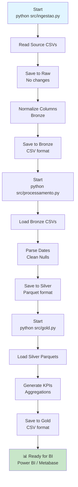

# Documentação Geral - E-Commerce Price Variation Pipeline

**Versão:** 1.0  
**Data:** Dezembro 2025  
**Autor:** Projeto TrabalhoBigData  

---

## Índice

1. [Descrição do Problema](#descrição-do-problema)
2. [Objetivos do Sistema](#objetivos-do-sistema)
3. [Escopo da Solução](#escopo-da-solução)
4. [Arquitetura Completa](#arquitetura-completa)
5. [Ferramentas e Tecnologias](#ferramentas-e-tecnologias)
6. [Decisões Técnicas](#decisões-técnicas)
7. [Guia de Execução](#guia-de-execução)
8. [Guia de Dependências](#guia-de-dependências)
9. [Descrição dos Dados](#descrição-dos-dados)
10. [Pontos de Falha e Limitações](#pontos-de-falha-e-limitações)

---

## Descrição do Problema

### Contexto

O projeto aborda a **análise de variações de preços em e-commerce** utilizando dados históricos do setor de vendas online brasileiro. O dataset Olist (Brazilian E-Commerce Public Dataset) contém informações reais de transações de um marketplace multi-vendedor.

### Desafios

1. **Volume de Dados**: Millões de registros de pedidos, produtos, vendedores e preços requerem processamento eficiente
2. **Heterogeneidade de Dados**: Dados brutos com inconsistências de nomenclatura, tipos e valores faltantes
3. **Análise Temporal**: Identificar padrões de preço ao longo do tempo é complexo sem estruturação adequada
4. **Escalabilidade**: A solução deve permitir adicionar novas fontes de dados sem refatoração completa

### Problema Central

> Como estruturar e processar dados de e-commerce para extrair insights sobre variação de preços em categorias de produtos e períodos temporais, permitindo que ferramentas de BI (Business Intelligence) façam análises autoatendidas?

---

## Objetivos do Sistema

### Objetivos Primários

1. **Ingestão Automatizada**: Carregar dados de múltiplas fontes CSV com normalização básica
2. **Processamento em Camadas**: Implementar arquitetura de data lake com raw → bronze → silver → gold
3. **Transformação de Qualidade**: Padronizar tipos de dados, tratar nulos e normalizar nomenclaturas
4. **Geração de KPIs**: Produzir métricas prontas para visualização (preço médio por categoria, variação mensal)
5. **Integração com BI**: Exportar dados estruturados (Parquet/CSV) para ferramentas como Power BI ou Metabase

### Objetivos Secundários

- Fornecer rastreabilidade completa (raw → gold)
- Permitir reprocessamento incremental
- Documentar esquemas de dados em cada camada
- Facilitar manutenção e extensão do pipeline

### Justificativa Técnica

A arquitetura em camadas (Medallion Architecture) oferece:
- **Isolamento**: Cada etapa tem responsabilidade única
- **Rastreabilidade**: Dados brutos preservados para auditoria
- **Flexibilidade**: Novas transformações adicionadas sem afetar existentes
- **Performance**: Formatos otimizados (Parquet) em camadas superiores
- **Governança**: Controle explícito sobre qualidade dos dados em cada nível

---

## Escopo da Solução

### Incluído

| Item | Descrição |
|------|-----------|
| **Ingestão (Raw)** | Leitura de CSVs da pasta Source; cópia sem alteração para Raw |
| **Normalização (Bronze)** | Limpeza de nomes de colunas (snake_case, alfanuméricos) |
| **Processamento (Silver)** | Conversão de tipos, tratamento de nulos, validação básica |
| **Agregação (Gold)** | KPIs: preço médio por categoria, variação mensal de preços |
| **Exportação** | Formatos CSV (Gold) e Parquet (Silver) para BI tools |
| **Logging** | Rastreamento de execução e erros em cada etapa |
| **Infraestrutura Opcional** | Docker Compose com MinIO para armazenamento distribuído |

### Não Incluído

| Item | Motivo |
|------|--------|
| **Orchestração (Airflow, Dagster)** | Escopo simplificado; execução manual ou cron jobs |
| **Data Warehouse (Snowflake, BigQuery)** | Foco em estrutura local; extensível a cloud |
| **ML/Previsão** | Foco em análise descritiva; não preditiva |
| **API REST** | Dados consumidos diretamente de arquivos |
| **Testes Automatizados** | Escopo mínimo; testes manuais esperados |
| **CI/CD Pipeline** | Não configurado; pode ser adicionado |
| **Replicação de Dados** | Operação unitária, não contínua |
| **Data Quality Checks Complexos** | Validações básicas apenas |

---

## Arquitetura Completa

### 1. Arquitetura Geral (Medallion Architecture)

```
┌──────────────────────────────────────────────────────────────────┐
│                     E-COMMERCE PRICE VARIATION PIPELINE            │
└──────────────────────────────────────────────────────────────────┘

┌─────────────┐     ┌──────────────────┐     ┌──────────────────┐
│   SOURCE    │     │      RAW LAYER   │     │   BRONZE LAYER   │
│  (External) │────▶│ (Dados Brutos)   │────▶│ (Normalizado)    │
└─────────────┘     └──────────────────┘     └──────────────────┘
     ▲                       │                        │
     │                       │                        │
  CSV Files             CSV Format             CSV Format
  (Olist Dataset)       No Changes            Column Names:
                        Preservação            - snake_case
                        Completa              - only alphanumeric
                                             - normalized spacing

        ┌──────────────────┐     ┌──────────────────┐
        │  SILVER LAYER    │     │   GOLD LAYER     │
        │ (Processado)     │────▶│ (KPIs/Analytics) │
        └──────────────────┘     └──────────────────┘
             │                           │
        Parquet Format              CSV Format
        - Type Parsing              - avg_price_by_category
        - Null Handling            - price_variation_by_month
        - Date Conversion          (Ready for BI)
```

### 2. Estrutura de Diretórios

```
TrabalhoBigData/
├── src/                              # Scripts Python
│   ├── ingestao.py                  # Raw → Bronze
│   ├── processamento.py              # Bronze → Silver
│   ├── gold.py                       # Silver → Gold
│   ├── processamento_fix.py          # Versão alternativa
│   ├── gold_fix.py                   # Versão alternativa
│   └── __pycache__/                 # Cache Python
├── Datasets/                         # Data Lake
│   ├── Source/                      # Dados externos (Olist)
│   ├── Raw/                         # Cópia literal
│   ├── Bronze/                      # Normalizado
│   ├── Silver/                      # Processado (Parquet)
│   └── Gold/                        # KPIs (CSV)
├── infra/
│   └── docker-compose.yaml          # MinIO (opcional)
├── docs/
│   ├── DOCUMENTACAO_GERAL.md        # Este arquivo
│   └── confluence_template.md        # Template Confluence
├── diagrams/
│   └── architecture.mmd              # Diagrama Mermaid
├── requirements.txt                  # Dependências Python
└── README.md                         # Quick start
```

### 3. Fluxo de Dados Detalhado

#### **Etapa 1: Ingestão (ingestao.py)**

```
Input: Datasets/Source/*.csv (Olist Dataset)
  ├─ olist_customers_dataset.csv
  ├─ olist_orders_dataset.csv
  ├─ olist_order_items_dataset.csv
  ├─ olist_products_dataset.csv
  └─ olist_sellers_dataset.csv

Processing:
  1. Read CSV file → pandas DataFrame
  2. Save unmodified → Datasets/Raw/
  3. Normalize column names:
     - Strip whitespace
     - Convert to lowercase
     - Replace spaces with underscores
     - Remove special characters (keep only alphanumeric + _)
     - Remove leading/trailing underscores
  4. Save normalized → Datasets/Bronze/

Output: Datasets/Bronze/*.csv (Normalized CSVs)
```

**Função Principal: `ingest_csv()`**

```python
# Normalização de colunas
def _norm_column(col: str) -> str:
    col = str(col).strip().lower()
    col = re.sub(r"\s+", "_", col)                    # espaços → _
    col = re.sub(r"[^0-9a-zA-Z_]+", "_", col)       # caracteres especiais
    col = re.sub(r"_+", "_", col)                     # múltiplos _ → _
    return col.strip("_")
```

#### **Etapa 2: Processamento (processamento.py)**

```
Input: Datasets/Bronze/*.csv (Normalized CSVs)

Processing:
  1. Load each Bronze CSV
  2. Standardize column names (lowercase, trim)
  3. Parse dates:
     - Detecta colunas com 'date', '_dt', '_date'
     - Converte para datetime (coerce errors → NaT)
  4. Fill nulls for numeric columns:
     - Select numeric columns
     - Replace NaN with 0
  5. Save to Parquet (compression, efficient storage)

Output: Datasets/Silver/*.parquet (Processed Data)

Exemplo de conversão:
  Entrada (Bronze):
    order_id | order_purchase_timestamp | order_value | ...
    1        | 2016-09-04 21:15:13     | 50.3       | ...
    2        | NULL                     | NULL       | ...

  Saída (Silver):
    order_id | order_purchase_timestamp | order_value | ...
    1        | 2016-09-04 21:15:13     | 50.3       | ...
    2        | NaT                      | 0          | ...
    
  (Parquet format, compressed)
```

#### **Etapa 3: Agregação Gold (gold.py)**

```
Input: Datasets/Silver/*.parquet (Processed Data)

Processing:
  1. Load all Silver Parquet files as DataFrames
  2. Generate KPI 1: avg_price_by_category
     - Join order_items (price) + products (category)
     - GROUP BY product_category_name
     - Calculate MEAN(price)
     - Output: category | avg_price
     
  3. Generate KPI 2: price_variation_over_time
     - Extract order_approved_at month
     - GROUP BY month
     - Calculate MEAN, MIN, MAX of price
     - Output: month | avg_price | min_price | max_price

Output: Datasets/Gold/*.csv (Ready for BI)
```

### 4. Fluxo de Execução Pipeline



---

## Ferramentas e Tecnologias

### Linguagem & Runtime

| Tecnologia | Versão | Propósito |
|-----------|--------|----------|
| **Python** | 3.8+ | Linguagem principal para processamento |
| **pip** | Latest | Gerenciador de pacotes Python |

### Dependências de Processamento

| Biblioteca | Versão | Propósito |
|-----------|--------|----------|
| **pandas** | ≥1.3 | Manipulação de DataFrames, leitura/escrita CSV |
| **pyarrow** | ≥8.0 | Engine para Parquet, integração com pandas |
| **fastparquet** | ≥0.8 | Engine alternativa para Parquet |
| **pyspark** | ≥3.2 | Opcional: processamento distribuído em escala |

### Armazenamento (Opcional)

| Ferramenta | Versão | Propósito |
|-----------|--------|----------|
| **MinIO** | latest | S3-compatible object storage (Docker) |
| **Docker** | Latest | Containerização (docker-compose) |

### Infraestrutura & Deployment

| Ferramenta | Propósito |
|-----------|----------|
| **File System** | Armazenamento local (Datasets/) |
| **Docker Compose** | Orquestração de containers (MinIO) |

### Ferramentas de BI (Downstream)

- **Power BI**: Importação de CSV/Parquet do Gold
- **Metabase**: Query sobre CSVs em Gold
- **Tableau**: Integração com dados estruturados
- **Google Sheets / Excel**: Importação direta de CSVs

### Versões Específicas em requirements.txt

```
pandas>=1.3
pyarrow>=8.0
fastparquet>=0.8
pyspark>=3.2  # optional
```

---

## Decisões Técnicas

### 1. Arquitetura Medallion (Raw → Bronze → Silver → Gold)

**Alternativas Consideradas:**
- ❌ Pipeline único (Raw → Gold): Perda de rastreabilidade, difícil auditoria
- ❌ Data Warehouse centralizado (Snowflake): Custo $$, overkill para escopo inicial
- ✅ **Medallion Local**: Simplicidade, rastreabilidade, extensível

**Trade-offs:**
- ✅ Preserva dados brutos para reprocessamento
- ✅ Cada camada tem responsabilidade clara
- ❌ Uso de disco duplicado (Raw + Bronze similar)
- ❌ Processamento sequencial (não paralelo)

### 2. Formatos de Arquivo por Camada

| Camada | Formato | Justificativa |
|--------|---------|---------------|
| **Raw** | CSV | Preservação literal; simples, universal |
| **Bronze** | CSV | Compatível com ferramentas padrão |
| **Silver** | **Parquet** | Compressão, tipos nativos, eficiência |
| **Gold** | CSV | Universalidade para BI tools |

**Por que Parquet em Silver?**
- Compressão automática (reduz 70-90% do tamanho)
- Tipos de dados preservados (date, int, float nativo)
- Query push-down (leitura seletiva de colunas)
- Standard em data lakes (Spark, Hadoop, etc.)

### 3. Normalização de Colunas em Bronze

**Problema:** Dados Olist têm nomes inconsistentes
- "Product Category Name", "PRODUCT_CATEGORY_NAME", "product category name"

**Solução Adotada:**
```python
def _norm_column(col: str) -> str:
    col = str(col).strip().lower()              # lowercase
    col = re.sub(r"\s+", "_", col)             # espaços → _
    col = re.sub(r"[^0-9a-zA-Z_]+", "_", col) # especiais → _
    col = re.sub(r"_+", "_", col)              # _ múltiplos → _
    return col.strip("_")
```

**Trade-offs:**
- ✅ Consistência garantida
- ✅ SQL-friendly (snake_case)
- ❌ Perde alguns caracteres (é → e, ç → c)
- ❌ Colunas com símbolos podem se confundir

### 4. Tratamento de Nulos em Silver

**Abordagem:**
- Colunas numéricas: fill NaN com 0
- Colunas texto: deixar NaN (NULL)
- Datas: coerce invalid → NaT

**Justificativa:**
- 0 é seguro para agregações (SUM, AVG)
- NaT preserva semântica de dados faltantes
- Evita correlações falsas

**Limitação:** Nem sempre 0 é apropriado (ex: preço 0 ≠ nulo)

### 5. KPIs em Gold

**Gerados:**

1. **avg_price_by_category**
   ```
   product_category_name | avg_price
   electronics           | 150.45
   books                 | 25.30
   ```

2. **price_variation_by_month**
   ```
   month  | avg_price | min_price | max_price
   2016-09 | 100.00   | 10.00     | 5000.00
   2016-10 | 105.50   | 15.00     | 4500.00
   ```

**Por que estes KPIs?**
- Respondentes a perguntas de negócio
- Fácil visualização em BI
- Agregações simples (GROUP BY, AVG)

### 6. Processamento Sequencial vs. Paralelo

**Decisão:** Sequencial (Raw → Bronze → Silver → Gold)

**Trade-offs:**
- ✅ Simples de entender e debugar
- ✅ Usa menos memória
- ❌ Mais lento em datasets grandes (milhões de linhas)
- ❌ Não aproveita múltiplos cores

**Como Escalar:**
- Substituir pandas → PySpark para paralelismo
- Usar Airflow/Prefect para orquestração
- Cloud: Databricks, Google Cloud Dataflow

---

## Guia de Execução

### Pré-requisitos

- **Sistema Operacional**: Windows / macOS / Linux
- **Python**: 3.8+ instalado
- **pip**: Gerenciador de pacotes Python
- **Git**: Para clonar repositório
- **VS Code** (Opcional): Para editar/debugar código

### 1. Clone o Repositório

```powershell
# Clone
git clone https://github.com/HenriqueForin0905/TrabalhoBigData.git

# Entre no diretório
cd TrabalhoBigData

# Abra no VS Code (opcional)
code .
```

### 2. Configure o Ambiente

```powershell
# Crie um Virtual Environment (recomendado)
python -m venv venv

# Ative o Virtual Environment
# Windows:
.\venv\Scripts\Activate.ps1

# macOS/Linux:
source venv/bin/activate

# Instale dependências
python -m pip install --upgrade pip
python -m pip install -r requirements.txt
```

**Verificar instalação:**
```powershell
python -c "import pandas; import pyarrow; print('OK')"
```

### 3. Prepare os Dados Fonte (Source)

Obtenha o dataset Olist:

```powershell
# Opção 1: Download manual
# Visite: https://www.kaggle.com/datasets/olistbr/brazilian-ecommerce
# Extraia em: Datasets/Source/

# Opção 2: Criar estrutura de exemplo
mkdir -p Datasets/Source
# Coloque CSVs aqui: olist_*.csv
```

**Arquivos esperados em Datasets/Source/:**
```
olist_customers_dataset.csv
olist_orders_dataset.csv
olist_order_items_dataset.csv
olist_products_dataset.csv
olist_sellers_dataset.csv
```

### 4. Execute o Pipeline Completo

#### **Etapa 1: Ingestão (Raw → Bronze)**

```powershell
python .\src\ingestao.py
```

**Saída esperada:**
```
2025-12-10 14:30:45 INFO Using source dir: C:\...\Datasets\Source
2025-12-10 14:30:46 INFO Ingesting file: olist_customers_dataset.csv
2025-12-10 14:30:46 INFO Saved RAW: C:\...\Datasets\Raw\olist_customers_dataset.csv
2025-12-10 14:30:46 INFO Saved BRONZE: C:\...\Datasets\Bronze\olist_customers_dataset.csv
...
```

**Diretórios criados:**
- `Datasets/Raw/` - Cópia literal
- `Datasets/Bronze/` - Normalizado

#### **Etapa 2: Processamento (Bronze → Silver)**

```powershell
python .\src\processamento.py
```

**Saída esperada:**
```
2025-12-10 14:31:00 INFO Processing Bronze file: C:\...\Bronze\olist_customers_dataset.csv
2025-12-10 14:31:01 INFO Saved Silver parquet: C:\...\Silver\olist_customers_dataset.parquet
...
```

**Diretório criado:**
- `Datasets/Silver/` - Arquivos .parquet

#### **Etapa 3: Agregação (Silver → Gold)**

```powershell
python .\src\gold.py
```

**Saída esperada:**
```
2025-12-10 14:32:00 INFO Saved avg_price_by_category
2025-12-10 14:32:00 INFO Saved price_variation_by_month
```

**Diretório criado:**
- `Datasets/Gold/` - KPIs em CSV

### 5. Valide os Resultados

```powershell
# Verifique estrutura de diretórios
Get-ChildItem -Recurse .\Datasets\ | Select-Object FullName

# Verifique tamanho dos arquivos
ls -R .\Datasets\ | Format-Table Name, Length

# Inspecione KPIs gerados
Get-Content .\Datasets\Gold\avg_price_by_category.csv | Select-Object -First 10
Get-Content .\Datasets\Gold\price_variation_by_month.csv
```

### 6. Integre com BI Tool

#### **Power BI**

1. Abra Power BI Desktop
2. Home → Get Data → Folder
3. Aponte para `Datasets/Gold/`
4. Selecione arquivos CSV
5. Transform → Load
6. Crie visualizações

#### **Metabase**

1. Inicie Metabase (Docker ou local)
2. Admin Settings → Databases
3. Add Database → File
4. Aponte para `Datasets/Gold/`
5. Browse → Create Dashboard

### 7. Automação (Cron/Task Scheduler)

#### **Windows Task Scheduler**

```powershell
# Crie arquivo batch: run_pipeline.bat
@echo off
cd C:\Users\Administrador\TrabalhoBigData
.\venv\Scripts\Activate.ps1
python .\src\ingestao.py
python .\src\processamento.py
python .\src\gold.py
echo Pipeline executed at %date% %time% >> pipeline.log
```

Agenda no Task Scheduler:
- Ação: Executar `run_pipeline.bat`
- Frequência: Diária às 02:00

#### **Linux/macOS Cron**

```bash
# Edite crontab
crontab -e

# Adicione:
0 2 * * * cd /path/to/TrabalhoBigData && python src/ingestao.py && python src/processamento.py && python src/gold.py >> pipeline.log 2>&1
```

---

## Guia de Dependências

### Versões Mínimas

```
Python                          3.8+
pandas                          1.3+
pyarrow (Parquet)              8.0+
fastparquet (Parquet alt.)     0.8+
pyspark (Opcional)             3.2+
```

### Instalação Detalhada

```powershell
# 1. Upgrade pip
python -m pip install --upgrade pip

# 2. Instale requirements
pip install -r requirements.txt

# 3. Verifique versões
pip show pandas pyarrow fastparquet

# 4. (Opcional) Instale PySpark para distribuição
pip install pyspark==3.2.0
```

### Dependências de Sistema

| Componente | Sistema | Versão |
|-----------|--------|--------|
| **Python** | Windows/Mac/Linux | 3.8+ |
| **Java** | Todos | 8+ (se usar PySpark) |
| **Docker** | Todos | 20.10+ (se usar MinIO) |

### MinIO (Opcional) - Docker Setup

```powershell
# Inicie MinIO
docker-compose -f .\infra\docker-compose.yaml up -d

# Acesse console
# URL: http://localhost:9001
# User: minioadmin
# Password: minioadmin

# Parar serviço
docker-compose -f .\infra\docker-compose.yaml down
```

### Verificação de Compatibilidade

```python
# test_dependencies.py
import sys
import pandas as pd
import pyarrow as pa

print(f"Python: {sys.version}")
print(f"pandas: {pd.__version__}")
print(f"pyarrow: {pa.__version__}")

# Teste conversão Parquet
df = pd.DataFrame({'col1': [1, 2], 'col2': ['a', 'b']})
table = pa.Table.from_pandas(df)
print("Parquet support: OK")
```

---

## Descrição dos Dados

### Origem dos Dados

**Fonte:** Olist Brazilian E-Commerce Public Dataset  
**URL:** https://www.kaggle.com/datasets/olistbr/brazilian-ecommerce  
**Cobertura:** Pedidos de 2016-09 a 2018-10  
**Registros:** ~100k pedidos, ~1M linhas totais  
**Tamanho:** ~50-100 MB (dados brutos)  

### Tabelas/Datasets Principais

#### 1. **olist_orders_dataset.csv**

| Coluna | Tipo | Descrição |
|--------|------|-----------|
| `order_id` | String | Identificador único do pedido |
| `customer_id` | String | ID do cliente |
| `order_status` | String | Status: delivered, cancelled, etc. |
| `order_purchase_timestamp` | DateTime | Quando o cliente fez a compra |
| `order_approved_at` | DateTime | Quando a compra foi aprovada |
| `order_delivered_carrier_date` | DateTime | Entrega pela transportadora |
| `order_delivered_customer_date` | DateTime | Entrega ao cliente |
| `order_estimated_delivery_date` | DateTime | Estimativa de entrega |

**Exemplo:**
```csv
order_id,customer_id,order_status,order_purchase_timestamp,...
e481f51cbdc54880170b7347a100c59b,9ef432eb6251297304e56dae2a56bf39,delivered,2016-09-04 21:15:13,...
```

#### 2. **olist_order_items_dataset.csv**

| Coluna | Tipo | Descrição |
|--------|------|-----------|
| `order_id` | String | FK para orders |
| `order_item_id` | Int | Sequência do item no pedido |
| `product_id` | String | FK para products |
| `seller_id` | String | FK para sellers |
| `shipping_limit_date` | DateTime | Limite para envio |
| `price` | Float | Preço unitário do produto |
| `freight_value` | Float | Custo do frete |

**Exemplo:**
```csv
order_id,order_item_id,product_id,seller_id,price,freight_value
e481f51cbdc54880170b7347a100c59b,1,4244733047069,8e378e3d18f54efd,58.90,13.29
```

#### 3. **olist_products_dataset.csv**

| Coluna | Tipo | Descrição |
|--------|------|-----------|
| `product_id` | String | Identificador único |
| `product_category_name` | String | Categoria do produto |
| `product_name_lenght` | Int | Comprimento do nome |
| `product_description_lenght` | Int | Comprimento da descrição |
| `product_photos_qty` | Int | Número de fotos |
| `product_weight_g` | Float | Peso em gramas |
| `product_length_cm` | Float | Comprimento em cm |
| `product_height_cm` | Float | Altura em cm |
| `product_width_cm` | Float | Largura em cm |

**Exemplo:**
```csv
product_id,product_category_name,product_weight_g
4244733047069,telefonia,600
```

#### 4. **olist_customers_dataset.csv**

| Coluna | Tipo | Descrição |
|--------|------|-----------|
| `customer_id` | String | Identificador único |
| `customer_zip_code_prefix` | String | CEP (5 dígitos) |
| `customer_city` | String | Cidade |
| `customer_state` | String | UF (estado) |

#### 5. **olist_sellers_dataset.csv**

| Coluna | Tipo | Descrição |
|--------|------|-----------|
| `seller_id` | String | Identificador único |
| `seller_zip_code_prefix` | String | CEP (5 dígitos) |
| `seller_city` | String | Cidade |
| `seller_state` | String | UF |

### Dicionário de Dados por Camada

#### **RAW Layer**
- **Formato:** CSV
- **Modificações:** Nenhuma
- **Preservação:** 100%
- **Uso:** Auditoria, reprocessamento

#### **BRONZE Layer**
- **Formato:** CSV
- **Transformações:**
  - Normalização de nomes de colunas (snake_case)
  - Sem alteração de valores
- **Exemplo antes/depois:**
  ```
  Antes: "Product Category Name", "Product Weight (g)"
  Depois: product_category_name, product_weight_g
  ```

#### **SILVER Layer**
- **Formato:** Parquet
- **Transformações:**
  - Tipos de dados padronizados
  - Datas convertidas para datetime
  - Nulos em numéricos preenchidos com 0
  - Linhas: mesmo que Bronze (sem filtro)
- **Colunas:** Idênticas ao Bronze (nomes normalizados)

#### **GOLD Layer**

**Tabela 1: avg_price_by_category.csv**
```csv
product_category_name,avg_price
telefonica,150.45
electronics,120.30
books,25.00
```

**Tabela 2: price_variation_by_month.csv**
```csv
month,avg_price,min_price,max_price
2016-09,100.00,10.00,5000.00
2016-10,105.50,12.00,4800.00
```

### Estatísticas do Dataset

| Métrica | Valor |
|---------|-------|
| Total de Pedidos | ~100,000 |
| Total de Itens | ~1,000,000 |
| Período | 2016-09 a 2018-10 |
| Categorias Únicas | ~70 |
| Vendedores | ~3,500 |
| Clientes | ~100,000 |
| Preço Médio | ~120 BRL |
| Preço Mín/Máx | 0.85 / 13,664 BRL |

### Qualidade dos Dados Originais

| Problema | Frequência | Impacto |
|----------|-----------|--------|
| Nomes de colunas inconsistentes | Alta | Bronze normaliza |
| Valores nulos em preço | Baixa | Silver preenche com 0 |
| Datas inválidas | Média | Silver converte → NaT |
| Valores de preço 0 | Baixa | Questionável (desconto?) |
| Duplicatas de product_id | Rara | Mantidas (agrupação em Gold) |

---

## Pontos de Falha e Limitações

### Falhas Operacionais

#### 1. **Arquivo Source Não Encontrado**

**Problema:**
```
WARNING: Source file not found: Datasets/Source/olist_customers_dataset.csv
```

**Causa:** Arquivo não copiado ou estrutura de diretórios incorreta

**Solução:**
- ✅ Verificar se arquivos estão em `Datasets/Source/`
- ✅ Usar argumentos `--source` e `--datasets-dir`:
  ```powershell
  python src/ingestao.py --source "C:\path\to\data" --datasets-dir "C:\path\to\Datasets"
  ```

#### 2. **Erro de Memória (OutOfMemory)**

**Problema:** Dataset grande carregado completamente em RAM
```
MemoryError: Unable to allocate XXX MB
```

**Causa:** pandas carrega arquivo inteiro em memória

**Solução:**
- Usar `pd.read_csv(chunksize=10000)` para arquivos > 1GB
- Migrar para PySpark (processamento distribuído)
- Aumentar RAM da máquina

#### 3. **Colunas Duplicadas Após Normalização**

**Problema:**
```
"Price!" e "Price@" → ambas normalizam para "price"
```

**Solução:**
- Adicionar counter a duplicatas:
  ```python
  if col in seen:
      col = f"{col}_{counter}"
  ```

#### 4. **NaT vs. 0 em Colunas Numéricas**

**Problema:** Preço 0 é ambíguo (falta de dados? Promoção?)

**Solução:**
- Documentar claramente a política
- Usar -1 ou NaN em vez de 0
- Validações específicas por coluna

### Limitações Arquiteturais

#### 1. **Processamento Sequencial (Não Paralelo)**

| Aspecto | Limitação |
|--------|-----------|
| **Velocidade** | Etapas executadas em série (Raw → Bronze → Silver → Gold) |
| **Escalabilidade** | Dataset > 1GB pode ser lento em máquinas com <8GB RAM |
| **CPU** | Não aproveita múltiplos cores/CPUs |

**Impacto:**
- Pipeline 100k pedidos: ~2-5 minutos
- Pipeline 10M pedidos: ~1-2 horas

**Mitigação:**
```python
# Usar PySpark para paralelismo
from pyspark.sql import SparkSession

spark = SparkSession.builder.appName("Pipeline").getOrCreate()
df = spark.read.csv("source.csv")
# Processamento distribuído entre cores/nós
```

#### 2. **Sem Orchestração/Scheduling**

**Problema:**
- Execução manual
- Sem retry automático em caso de falha
- Sem dependências entre tarefas

**Solução:**
- ✅ Apache Airflow: DAGs, retry, monitoring
- ✅ Prefect: Cloud-native, UI intuitiva
- ✅ Cron/Task Scheduler: Simples para rotinas

#### 3. **Sem Data Quality Checks Complexos**

**Checagens Atuais:**
- ✓ Arquivo existe?
- ✓ Pode ler CSV?
- ✓ Pode escrever?

**Checagens Ausentes:**
- ✗ Número de linhas esperado?
- ✗ Valores em range válido (preço > 0)?
- ✗ Chaves estrangeiras válidas?
- ✗ Outliers detectados?
- ✗ Completude de dados (% não-nulos)?

**Exemplo de melhoria:**
```python
def validate_prices(df):
    invalid = df[(df['price'] < 0) | (df['price'] > 100000)]
    if len(invalid) > 0:
        raise ValueError(f"Invalid prices: {len(invalid)} rows")
```

#### 4. **Sem Versionamento de Dados**

**Problema:** Ao executar pipeline novamente, dados anteriores são sobrescritos

**Solução:**
```python
from datetime import datetime

run_id = datetime.now().strftime("%Y%m%d_%H%M%S")
gold_dir = datasets_dir / f"Gold_{run_id}"
```

#### 5. **Sem Infraestrutura de Backup**

**Risco:** Perda de dados se disco falhar

**Solução:**
- MinIO (S3-compatible) em infra/
- Backup automático para cloud (AWS S3, Azure Blob)
- Replicação para segundo disco

#### 6. **Sem API ou Exposição de Dados**

**Limitação:** BI tools devem ler arquivos localmente

**Solução:**
- FastAPI para expor dados via HTTP
- GraphQL para queries customizadas
- Conexão direta SQL (Sqlite3 layer)

#### 7. **Normalização de Colunas Destrutiva**

**Problema:**
```
Entrada:  "Produto (Categoria)"
Saída:    "produto_categoria"
Contexto: Parênteses perdidos
```

**Impacto:** Baixo (nomes apenas)

**Solução:** Manter mapping (original → normalizado) em arquivo CSV

#### 8. **KPIs Genéricos (Não Específicos do Negócio)**

**KPIs Atuais:**
- avg_price_by_category
- price_variation_by_month

**Análises Não Cobertas:**
- Sazonalidade (Black Friday?)
- Vendedores com melhor performance
- Clientes com maior lifetime value
- Taxa de devolução por categoria
- Correlação preço × avaliações

**Solução:** Estender `gold.py` com KPIs adicionais

### Limitações de Cobertura de Dados

#### 1. **Período Histórico Fixo**

**Limitação:** Dataset Olist é estático (2016-2018)

**Impacto:** Não reflete tendências recentes

**Solução:**
- Integração contínua com data provider (API)
- Append-only em Silver/Gold

#### 2. **Sem Dados Reais Atualizados**

**Problema:** Usando dataset público; dados reais de empresa em branco

**Solução:**
- Substituir Source por pipeline real (DB, API)
- Manter mesma arquitetura

#### 3. **Sem Contexto Externo**

**Dados Não Incluídos:**
- Macroeconomia (inflação, câmbio)
- Concorrência (preços de rivais)
- Sazonalidade (feriados, eventos)

**Impacto:** KPIs descontextualizados

### Recomendações de Melhoria

| Prioridade | Item | Esforço | ROI |
|-----------|------|--------|-----|
| **P0** | Data Quality Framework | Alto | Alto |
| **P0** | Orchestração (Airflow) | Alto | Alto |
| **P1** | Versionamento de Dados | Médio | Médio |
| **P1** | Testes Automatizados | Médio | Médio |
| **P2** | KPIs Customizados | Médio | Médio |
| **P2** | Backup/DR | Médio | Alto |
| **P3** | API REST | Alto | Baixo |
| **P3** | Data Catalog | Alto | Médio |

---

## Apêndice: Troubleshooting

### Problema: "ModuleNotFoundError: No module named 'pandas'"

```powershell
# Solução
pip install pandas>=1.3
```

### Problema: "No such file or directory: 'Datasets/Source'"

```powershell
# Solução
mkdir Datasets\Source
# Copie CSVs para este diretório
```

### Problema: Parquet files unreadable

```powershell
# Solução
pip install --upgrade pyarrow fastparquet
```

### Problema: OutOfMemory em datasets grandes

```powershell
# Use chunked reading
python src/processamento_fix.py  # versão otimizada
```

### Problema: Timestamps não parseiam corretamente

```python
# Verificar formato de data
df['order_purchase_timestamp'] = pd.to_datetime(
    df['order_purchase_timestamp'],
    format='%Y-%m-%d %H:%M:%S'  # formato explícito
)
```

---

## Conclusão

Este projeto implementa uma solução **end-to-end** de data lake com arquitetura medallion, processamento com Python/pandas e integração com ferramentas de BI. 

### Pontos Fortes
✅ Arquitetura clara e escalável  
✅ Rastreabilidade completa (Raw → Gold)  
✅ Formatos otimizados (Parquet)  
✅ Código documentado e modular  

### Áreas de Melhoria
⚠️ Sem orchestração automática  
⚠️ Validações de qualidade limitadas  
⚠️ Sem backup/DR  
⚠️ KPIs genéricos  

### Próximos Passos
1. Validar com dados reais da empresa
2. Implementar Airflow para agendamento
3. Adicionar data quality checks
4. Estender com KPIs de negócio específicos
5. Migrar para PySpark para escala

---

**Última Atualização:** Dezembro 2025  
**Mantido por:** Projeto TrabalhoBigData
